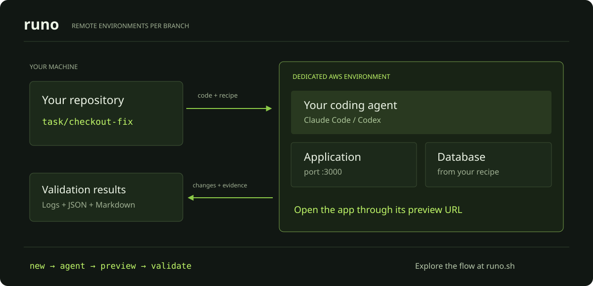

# Runo: remote development environments for coding agents

Runo gives each Git branch its own AWS EC2 environment. Run your application and its services alongside Claude Code or Codex, share a preview URL, and execute your validation steps before opening a pull request.

Built by [Kodus](https://kodus.io). [Website](https://runo.sh) · [Quickstart](docs/quickstart.md) · [Command reference](docs/reference.md)

## See how it works

[](https://runo.sh/#walkthrough)

[Explore the animated diagram](https://runo.sh/#walkthrough) · [How the workflow fits together](docs/workflow.md)

## Why a separate environment per branch?

When you run multiple branches on one machine, applications can compete for the same ports and database. Each Runo environment gets a dedicated VM, so the services you configure can run independently. Compute runs remotely, leaving your laptop available for other work.

An environment can exist while you develop, before a pull request is open. Use the preview to inspect the application and run the checks defined in your repository.

## First environment

You need Git, SSH, rsync and AWS access, or access to an existing Runo control plane. The installer can install Bun if it is missing. AWS resources and agent usage can incur charges.

```bash
git clone https://github.com/kodustech/runo.git
cd runo
./install.sh
```

The installer links the CLI and runs the setup checker. Follow its output to configure access. For a complete first run with an example API and Postgres, follow the [quickstart](docs/quickstart.md), including cleanup.

For a repository with a reviewed and committed `.kodus/workspace.yaml`:

```bash
runo new checkout-fix
runo agent claude --branch task/checkout-fix
runo url --open --branch task/checkout-fix
runo validate --branch task/checkout-fix
```

`runo new` creates a worktree but does not change your shell's directory. Use `--branch` from your original checkout, as above, or enter the worktree printed by the command.

## What runs where

Your local checkout is the sync point. Runo uploads code and runs the application's configured services on the VM. Claude Code or Codex runs there too, with access to that environment.

Your recipe describes setup, services and optional data initialization, plus the commands that count as validation. Runo runs those commands remotely and downloads their logs and results.

When the change is ready, `runo ship "your commit message" --validate` pulls the changes, validates and prepares the commit, push and PR. Run it inside the environment's worktree or select `--branch`. GitHub CLI (`gh`) must be installed and authenticated to create a PR. This command publishes code to your Git remote; it does not deploy your application to production.

## Choose your workflow

| I want to… | Start here |
| --- | --- |
| Try a small app with a database | [Quickstart](docs/quickstart.md) |
| Run Claude Code or Codex remotely | [Coding agents](docs/agents.md) |
| Run branches without shared local ports | [Branch environments](docs/branch-environments.md) |
| Configure services, profiles or validation | [CLI and environment reference](docs/reference.md) |
| Share previews with a team | [Shared previews](docs/shared-previews.md) |
| Administer a control plane | [Control plane panel](docs/control-plane-panel.md) |

## Costs and boundaries

- The current runtime provider is AWS EC2. With a control plane, the operator supplies AWS access; individual developers use a Runo token.
- Database creation and seeding depend on your recipe. External databases remain shared if your configuration points multiple environments at the same database.
- Preview URLs do not add authentication to your app. Use development data and credentials.
- A stopped VM can still incur storage charges. `runo destroy` removes the environment and its managed worktree; pull and save any changes you need first.
- Validation runs the checks you configure. Passing those checks is not a guarantee that a change is ready for production.

## Development

```bash
bun install
bun test
bun run bin/runo.ts --help
```

The static website lives in [`website/`](website/README.md).
